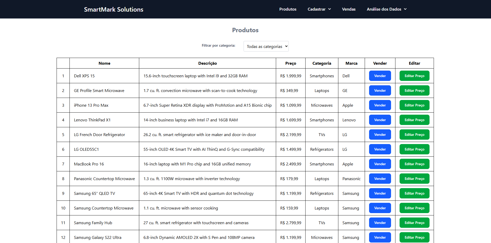
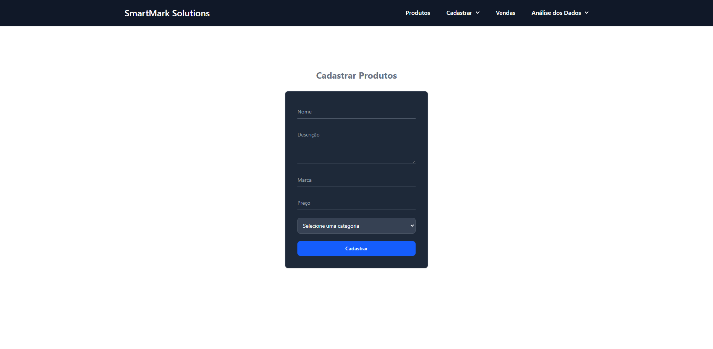
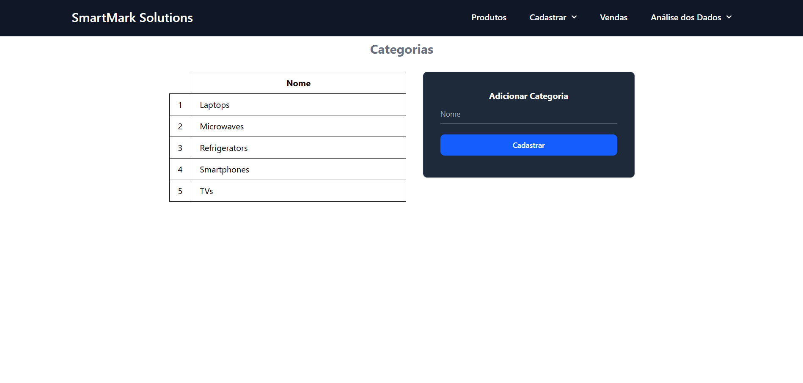
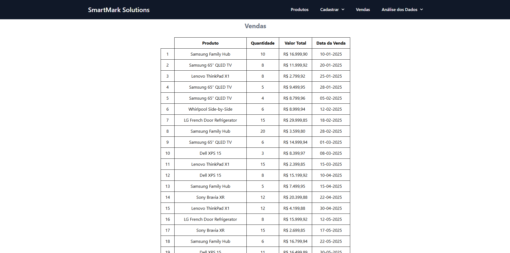
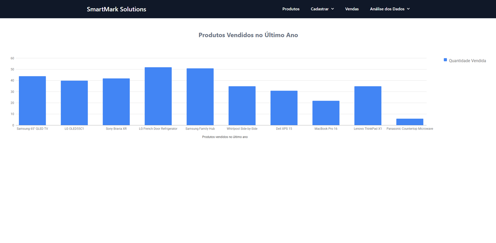
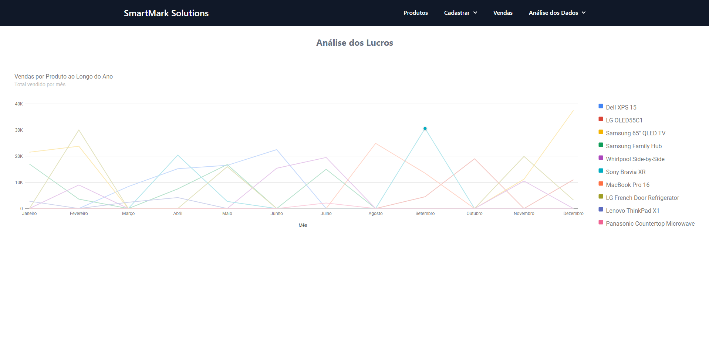

# Cardápio

## Objetivo

A SmartMart Solutions é uma empresa varejista digital em expansão que atua com múltiplos produtos e categorias em um ambiente altamente competitivo. O time de operações comerciais busca um sistema interno para cadastro, visualização e análise de produtos e vendas, com um painel visual simples e eficiente para auxiliar na tomada de decisões.

O objetivo foi construir o primeiro protótipo funcional dessa aplicação, unindo a construção de APIs em Python e uma interface visual em React. O objetivo também é criar uma base sólida para visualização de dados de vendas e permitir a inserção de produtos manualmente ou via arquivos CSV, com filtros e edição.

Tecnologias utilizadas:

- React.js – Para otimização e renderização eficiente.
- React Hooks – Para gerenciamento de estado.
- TailwindCSS – Para uma interface moderna e responsiva.

Funcionalidades Principais:

- Pordutos ("/") – Exibe a listagem de todos os produtos cadastrados, além de permitir a venda e a edição do preço dos mesmo, e filtrar os produtos por categoria;
- Cadastrar - Produtos ("/register-products") – Permite o cadastro no banco de dados de um novo produto
- Cadastrar - Categorias Categorias("/categories") – Exibe a listagem de todas as categorias cadastradas, além de permitir a inclusão de uma nova;
- Vendas("/sales") - Exibe a listagem de todos os produtos vendidos;
- Análise de Dados - Quantidade de Vendas – Exibe um gráfico de barras com a quantidade de vendas total para cada produto vendido;
- Análise de Dados - Análise de Lucros – Exibe um gráfico de linhas com o somantórios de todas das vendas de cada produto, por mês, podendo verificar em qual mês um determinado produto deu mais lucro.

### Conhecendo o projeto

O projeto que foi criado pode ser visto abaixo.

<figure>
  
  <figcaption align="center">
    Figura 1.
    
  Listagem dos Produtos.</figcaption>
</figure>

<figure>
  
  <figcaption align="center">
    Figura 2.
    
  Cadastro de Produtos.</figcaption>
</figure>

<figure>
  
  <figcaption align="center">
    Figura 3.
    
  Categorias.</figcaption>
</figure>

<figure>
  
  <figcaption align="center">
    Figura 4.
    
  Listagem de Vendas.</figcaption>
</figure>

<figure>
  
  <figcaption align="center">
    Figura 5.
    
  Gráfico de Barras com Quantidade de Vendas.</figcaption>
</figure>

<figure>
  
  <figcaption align="center">
    Figura 6.
    
  Gráfico de Linhas com os Comparativo dos Lucros para Cada Produto.</figcaption>
</figure>

### `npm start`

Para rodar o projeto no modo de desenvolvimento, execute o comando `npm dev`.
Abra [http://localhost:3000](http://localhost:3000 para visualizá-lo em seu navegador.

### `deploy`

O deploy da aplicação foi realizado na plataforma [Vercel](https://vercel.com/).
E poderá ser acompanhado através do seguinte link: [Cardápio](https://projeto-cardapio-iota.vercel.app/).
